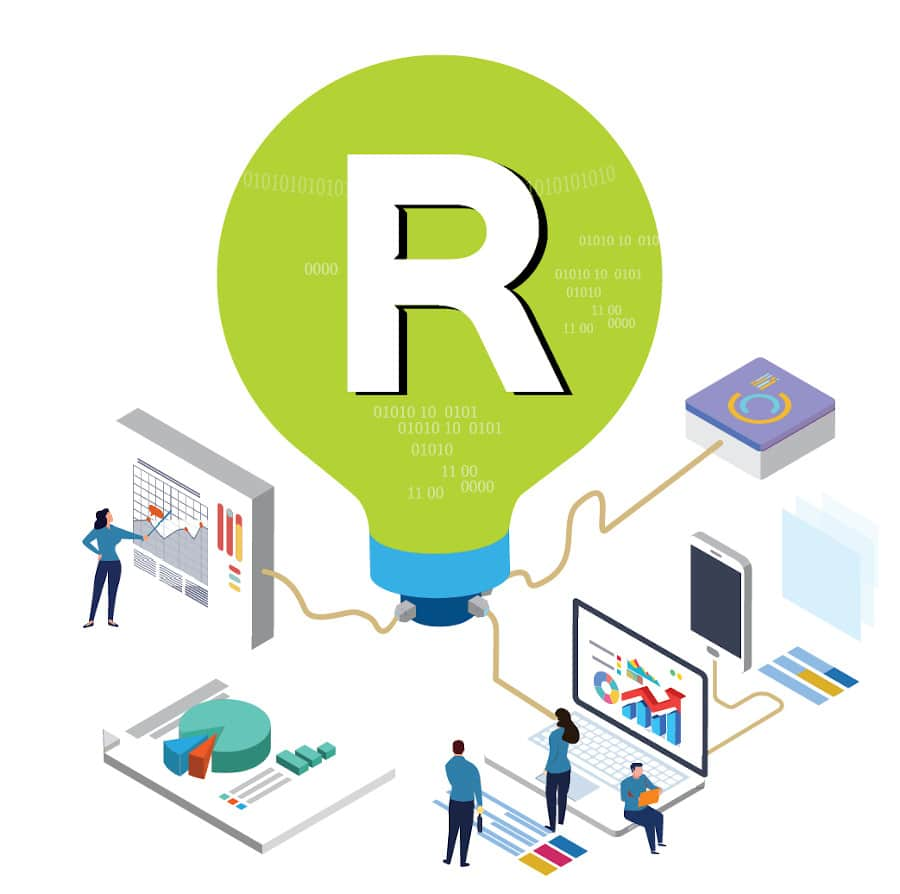
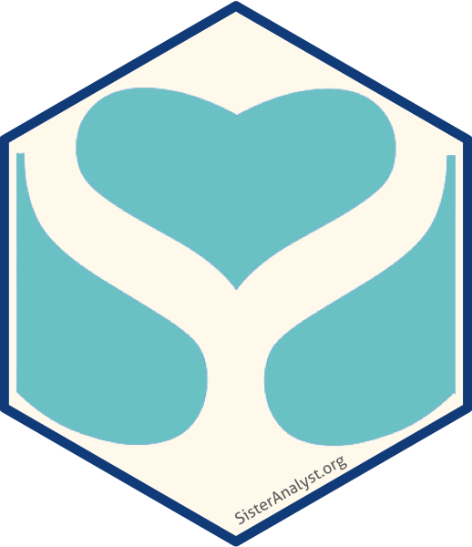
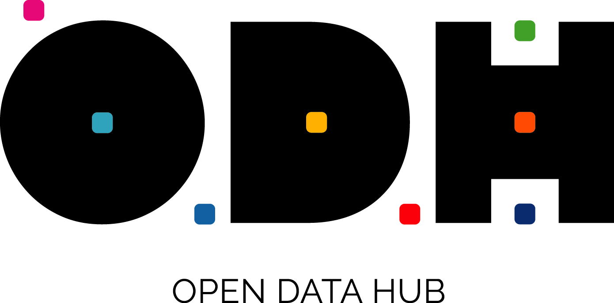
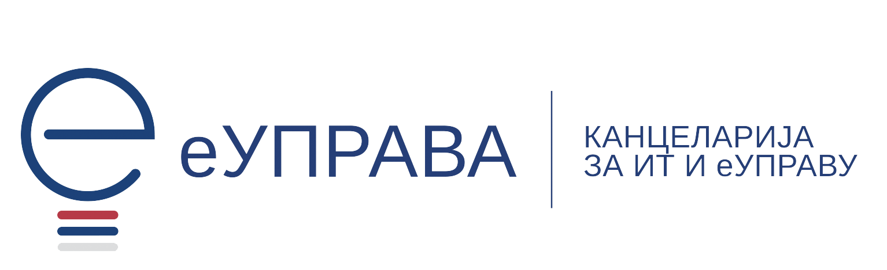

--- 
title: "Radionica: Izazov Otvorenih Podataka kroz R"
author: "Sister Analyst i Open Data Hub"
date: "25. Mart 2022."
output:
  prettydoc::html_pretty:
    theme: hpstr
    highlight: html_vignette
---

### Gde?

[{width=10%}](https://www.ite.gov.rs/)

**<span style="color:#27408B">U </span> [ICT Hub-u](http://www.bibliotekalazarevac.org.rs/) <span style="color:#27408B">, Kralja Milana 10, Beograd 11000</span>**

### Kad? 

**<span style="color:#27408B">U Petak, 25. Marta 2022. </span>**

### U koje vreme? 

**<span style="color:#27408B">Od 16:00 - 20:00 časova.</span>**

### Za koga je radionica? 

**<span style="color:#27408B">Radionica je namenjenja mladima i svima ostalima koji žele da se upoznaju i dele ideje i iskustva u radu sa otvorenim podacima kroz primenu programskog jezika [R](https://cran.r-project.org).</span>**

> #### Događaj je besplatan, ali je potrebna registracija popunjavanjem formulara za prijavu: [👉📄: prijavi se!](https://forms.gle/ior41Tv4QyPZ49Tx6)

---

```{r echo=FALSE, fig.align = 'center', fig.cap = "Ova radionica je deo [Open Data Hub::Open Data Week](https://hub.data.gov.rs/en/home/) projekta.", out.width = "50%"}

```

--- 

Sister Analist održava radionicu `Open Data Challenge with R` – radionicu koja ima za cilj da pruži pronicljiv pregled procesa demokratije podataka.

Sposobnost da informacije u digitalnom formatu budu dostupne svima u bilo koje vreme, bez prepreka za njihovu analizu, razumevanje i tumačenje je *sistem demokratizacije podataka*. To podrazumeva da javni organi stavljaju podatke na raspolaganje građanima, od kojih se očekuje da imaju neophodne sposobnosti i veštine da im pristupe, da ih analiziraju i tumače. Cilj toga je osnaživanje i motivisanje građanja u učeću donošenja javnih odluka zasnovanim na informacijama dostupnim kroz otvorene podatke. 

Samo kreiranjem praktičnog razumevanja procesa i procedura uključenih u analizu podataka moguće je postići cilj opismenjavanja kroz primenu podataka, termin bolje znani kao data literacy. Korišćenjem javno dostupnih, besplatnih softverskih paketa za analizu podataka, kao što su [R](https://www.r-project.org/) i [GitHub](https://github.com/), moguće je izgraditi razumevanje i znanje o sistemima koji se kreiraju u procesu analize podataka. Pokazaćemo vam kako da koristite [R](https://www.r-project.org/) za pristup podacima sa portala otvorenih podataka https://data.gov.rs i kako statistiku unutar podataka da pretvorite u razumljivu priču koja može da se koristi za rešavanje problema.

Učesnici radionice će se upoznati sa različitim načinima pristupa otvorenim podacima i moći će da se uključe u neophodne korake pripreme podataka za analizu. Biće im data prilika da se upoznaju sa tipičnim alatima koji se koriste u procesima analize podataka. Sve ovo će biti ilustrovano kroz primer rada sa podacima o kvalitetu vazduha, koji je u fokusu mnoguh diskusija građana Srbije. Učesnici će takođe moći da nauče kako da saopšte rezultate na transparentan i reproduciabilan način kreiranjem dinamičkih dokumenata. Pored toga, svi učesnici će biti upućeni na platformu [Open Data Challenge](https://www.r-project.org/) gde mogu naći materijal uz pomoć koga mogu da nauče kako da kreiraju besplatan hosting web stranica svojih analitičkih narativa i izveštaja koristeći [`HUGO`](https://gohugo.io) i [`blogdown`](https://bookdown.org/yihui/blogdown/) paketa. 

Sa sobom osim osmeha i entuzijazma za učenjem o korišćenju otvorenih podataka, možete poneti i laptom i zajedno sa nama pristupiti portalu https://data.gov.rs i kodirati u R-u!

Ne morate da budete R korisnik da biste došli i pridružili se našoj diskusiji sve dok ste zainteresovani da saznate više o procesu demokratizacije podataka 👩‍💻👨‍💻✊💪

Voleli bismo da dođete i pridružite nam se… Povedite prijatelja ili dva i podelite svoja razmišljanja i iskustva u radu sa podacima.

---

### Agenda

> - <span style="color:#27408B">**16:00 Otvaramo vrata:** registracija uz osveženje i grickalice</span>
> - <span style="color:#27408B">**16:15 Dobrodošli na Open Data Week Radionicu:** uvod i najava</span>
> - <span style="color:#27408B">**16:20 Radionica:** Izazov Otvorenih Podataka kroz R</span>
> - <span style="color:#27408B">**19:30 Družite se:** piće, pica i prilika za ćaskan</span>je
> - <span style="color:#27408B">**20:00 Kraj događaja:** zatvaramo vrata i dogovaramo ponovo druženje</span>

---

### Organizatori projekta:

[{width=11%}](https://sisteranalyst.org)
[{width=20%}](https://hub.data.gov.rs/en/home/)  

---

### Partneri projekta:

[{width=30%}](https://www.ite.gov.rs/)
[{width=12%}](https://www.gov.uk/world/organisations/british-embassy-belgrade)
[{width=20%}](https://www.gov.uk/world/organisations/british-embassy-belgrade)[{width=15%}](https://www.rs.undp.org/)

---
